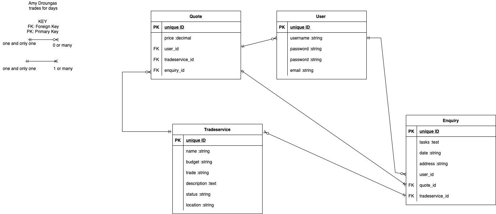
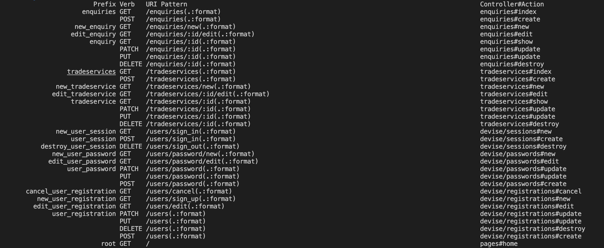

# README

#### R9 
https://trades-fordays.herokuapp.com/ 
#### R10 
https://github.com/droucode/tradesfordays 

#### R7 Identification of the problem you are trying to solve by building this particular marketplace app

Finding trades services for individuals who are new to renovating/making repairs to your home can be difficult. It is not until you're in that position when you're suddenly asking your friends and family,
```"Do you know a plumber? My bathroom needs repairs```
```and a carpenter to fit a new front, oh gosh i also need an electrician too install a new oven...."```

Google is a great resource however the search becomes overwhelming as it is saturated with results; Which ususally plays out as the following:
 1. Calling through lists of trades people.
 2. They're often on site at the time and unable not answer your call, while it could takes days to recieve a call back.
 3. Now you have lots of numbers and no leads, fustraton builds and your bathroom still needs repairs.
 4. They call back, with one of the following responses 
 - a) sorry i'm flat out 
 - b) i don't do that kind of work 
 - c) available, i'll come out for a quote. 
 5. Repeat steps 1-4 is the tradesperson isn't able to do the job. As you can see, this process which isn't very effcient. 


Creating trades for days, is a one stop shop for all of your trade service needs. How?

It is a Two-way Marketplace that allows trades people to list their service, availability, location and price rage. It also allows the user to search through listings/trade services and make enquiries (attaching photos and a task description) these get sent to the trades person, whereby they review and sent back a quote. From which booking the service is able to take place. 


Trades for days does come at at cost of $1, apon registration of the trades person and user, which is donated to Habitat for Humanity; A non-for-profit organisation that supports the build of affordable housing all around the world for those in need. Thay have helped 35 million people access safe housing and for aproximatly $5000 AUD the organisation is able to build a house for one family in need Asia-Pasific coutries. Remember, donations to not-for-profit organosations are tax deductable at the end of the financial year!

#### R8 Why is it a problem that needs solving?
This problem within the industy needs to be reoslved because Trade businesses are losing customers and individuals need direction and certainty when looking for and booking a service. There is a gap in the market and Trades for days fits into it nicely, allowing trades perople a space to manage their listings and quote, while also supporting the wider global community.

#### R11 Description of your marketplace app (website), including:

- Purpose: To better serve the trade industry, allowing licenced porfessionals the means to advertise and track their enquires, quotes and book jobs. While the user is able to register and easily search for their trades servies and filter by budget and availability; All while supporting an non-for-profot organisation.

- Functionality / features: Login, Create and Edit a listing, AWS S3 uploading images capability. 
- Sitemap application_sitemap
- Screenshots
- Target audience: Licenced Trades persons and Indivduals that require a service
- Tech stack: Ruby, Ruby on Rails, Postgresql, VS Code, AWS S3 html,Git, GitHub, HTML5 CSS3/SCSS,  Heroku, App.diagram.net (ERD, Sitemap), Trello, Balsamiq, Microsoft Powerpoint (Presentation)

#### R12 User stories for your app

##### As a Licences Trades person:

- I want to list my services.
- I want to list my availability.
- I want to list my location.
- I want to list my  price rage.
- I want to and manage quotes.
- I want to remove my listing.
- I want to register on the platform i am supporting the global housing community through my donation to Habitat for Humanity.

##### As a User:

- I want to make an enquiry;
- I want to upload pictures in my enquiry. 
- I want to store all of my enquiries and quotes.
- I want to update my enquiry.
- I want to delete an enquiry.
- I want to register on the platform i am supporting the global housing community through my donation to Habitat for Humanity.

##### Authentication/Autorisation and Privacy 
(User and Trades person)

- I want my dashboard to be private.
- I want my personal information and data to be protected.
- I want my enquiries to be private and not shared. 
- I want my quotes to be private and not shared.
- I do not want other users to have access to editing my enquiries/quotes/listing

#### R13 Wireframes
#### R14 ERD 




#### R15 Explain the different high-level components (abstractions) in your app

Application Core Components that make trades for days, and how they interact.   

Trades for days is a two sided marketplace, built on Ruby on Rails which hosts MVC software design pattern ( model, view, controller). It allows the software engineer to effectivly create applications by dividing each function. 

 The model contains data, states and logic used by the application.  
 The view is responsible for the user interface.
 Finally, the controller controller passes information and changes between the view and the model to the user.

##### View 
- Devise folder 
```new.html.erb```
linked to https://trades-fordays.herokuapp.com/users/sign_in, is where the user directed to sign in/sign up and be authenticated. This is achieved through the Devise Gem, that automatically generation registration and login forms. 

- Shared folder 
```_navbar.html.erb```
The navigation bar in started within a shared folder in views. This means that the navigation bar and corresponding links are views on each html.erb page throughout the application. 

- Tradeservices folder 
```_form.html.erb```
This file is responsible for storing the code for the forms which the user fills in; they include the Create Listing form and the Update Listing form. Within the form is calls upon the @tradeservice model. It is best practice to use a shared form, that is rendered into the new.html.erb and edit.html.erb as maintain DRY code. 

- Enquiry foler 
```_form.html.erb```
the same logic as above in applied here. 


##### Controller 

There are four controllers within this web-application. 

```application_controller.rb```
- This controller is responsible for setting the paramiters sign_up and devise. 

```enquiries_controller.rb```

UNANSWERED

```pages_controller.rb```
- Does not have a huge role within this application, it was created when devise was implemented in the application, and is the root directory. 

```tradeservices_controller.rb``
This controller is a large part of the application. It controls trade service listing, through CRUD(create, read, update and distroy). In this controller paramiters are set for Tradeservice, meaning when we use for example ```.find(param[:id])``` the the model and database to recall stored information. 

Parmiters are set through code such as 
```def``` ```tradeservice_params```
        ```params.require(:tradeservice).permit(:picture,:name,:budget,:trade,:description,:status,:location)end```  

Here in this example of code 
```def create ```
        ```@tradeservice = Tradeservice.create(tradeservice_params)```
        ```redirect_to tradeservices_path```
    ```end```

Within this controller there are before actions included: 

```before_action :authenticate_user!, :set_tradeservice, only: %i[ show edit update destroy ]```
```before_action :authenticate_user!, only:[:new, :edit, :show]```

What is happening here is that, the trades person must be authenicated before having access to create/edit/update/destroy a listing.


##### Routes 

Routes connect the entire website together, making the website flow and increase functionality. 
The way i have utilised routes.rb in within this application, is by using the resources method. 

This method is extremly usful as it generates a path that set into your databse making linking all your pages efficient. It also supports CRUD 

I chose to use the resource method for the two main controllers in my application (enquiries and tradeservice)

Here you can see my routes.rb configuration 

```Rails.application.routes.draw do```
  ```resources :enquiries```
  ```resources :tradeservices```
  ```devise_for :users```
```root "pages#home"```

Bellow you're able to see all routes that are automaticallty renerates using the resource method. 
As well as routes for the rest of the application, such as devise sign_in, sign_out etc. 




Also in this routes.rb, i have called upon the root for the application, which is pages#home. 
Without statging this, the application will not be accessible to the users. 

There is another component within routes, aside from the path and that is the HTTP methods they use. 
These mothods include, GET, POST, DELETE, PUT, and PATH, these are also intertwined with CRUD. 

GET: Is used to *read* or retrieve a representation of a source. GET requests are only used to read, not cange data. 
POST: Is used to *creat* a new resource, once a new resource is created the post method assigns a new ID. 
PUT: Is used to *update* a resource, creating a new representation of the data. 
PATCH: Is used to *modify* capabilities. The PATCH request only needs to include the changes made to the resource. 
DELETE: Is used to *destory* a resource which has an ID and represented in the URL. 

##### Models 

There are 4 main models used to create trades for days. 


##### enquiry.rb
##### Whats does it do?
This model holds the attributes of user, quote and tradeservice. 
##### What is the functionality?
By contains the attributes of user, quote and tradeservice the enquriry is able to retrive relivent data for the trade person. 
##### What problems does it solve?
By having key information available, in the enquiry it means that the enquiry is unique and accurate. 

##### quote.rb
##### Whats does it do?
Holds the unique id of the user and faciliates a quote for each enquiry 
##### What is the functionality?
Enables each unique enquiry to have a unique quote 
##### What problems does it solve?
It is spesific to the use as well as; If a quote didnt have the relationship for many enquiries, it would mean that each quote would not be unique to the enquriry. 

##### tradeservice.rb
##### Whats does it do?
Ensures that the trade service listing is able to hold many enquiries and quotes 
##### What is the functionality?
It allows for the submission of enquires, which could result in a quote. 
##### What problems does it solve?
The enquiry holds all of the information of the user, meaning that the trade service provider is able to review the orgin and details of the enquiry. It also allows data of the a quote to be stored. 

##### user.rb
##### Whats does it do?
Holds/recalls all of the data from the users enquiries and quotes 
##### What is the functionality?
Allows the user to submitand retain the data of many quotes and enquiries 
##### What problems does it solve?
If the relationships where set up differently, it would defeat the purpose of the web-application. The user can reach and send and collect as many enquires and quotes as required. 

##### Database 

PostgreSQL. It is an open source Relational Database Management System. It allows the application to stores and process data in table form. 


##### R16 Detail any third party services that your app will use
1. S3 Amazon Web Services
 
2. Heroku, deploymnet

##### Devise
Devise is a rails based ruby gem that is used of User Authentication. There is a wealth of pre build configurations to devise. 

- Generates forms which faciliate user registation and sign in. 
- Password option
- It gives the software developer many option and features such as, timeoutable.
- Store user password in hashes.

##### S3 AWS cloud storage

AWS is a free to register cloud storage system/platform, if offers security when uploading images/ because if you use a URL, the image may become compromised. Within trades for days, i utilised AWS S3 bucket, to enable to user to upload an image. The buckets are secure, to the creater. 

- Cloud data storage, minising the use of local storage. 
- It is important to be aware of keeping the AWS master key secure. 


#### R17 Describe your projects models in terms of the relationships (active record associations) they have with each other

##### has_many 
```user has_many enquirires```
```user has_mant quotes```
Means..  two separate models are sharing data through attributes. It also ensures, users are able to store many unique enquiries and quotes. 

```tradeservice has_many enquiries```
```tradeservice has_many quotes```
Means.. tradeservice is able to recieve many enquiries and many corresponsing unique quote. 

##### belongs_to 
As association whereby with each resource created for the model, it belong_to ONLY one other model, the attribues and FK. 
Within trades for days application: 
```enquiry belongs_to user```
```enquiry belongs_to quote```
```enquiry belongs_to tradeservice```
Means.. that each enquiry made is unique to a user. 
each enquiry made is unique to a quote.
each enquiry made is unique tradeservice. 

```quote belongs_to user```
Means.. each quote received by a user is unique and holds all the data through enquiries. 


#### R18 Discuss the database relations to be implemented in your application

##### Based on the Schema, tades for days database tables comprise of 

1. enquiries 
2. quotes 
3. tradeservices
4. users 

Within these tables are primary keys, which detail the data type and attribute of that row. 

There are also foreign keys, which are responsible for creating as association between tables. These are very useful when creating a database, because they ensure that there is no dupication of attribues and data from one table can be referneced to another without dublication. 

one-to-one / in trades for days 
Means.. one registration account per user. 

one-to-many / in trades for days 
- User can have many enquiries 
- User can have many quotes 

#### R19 Provide your database schema design


